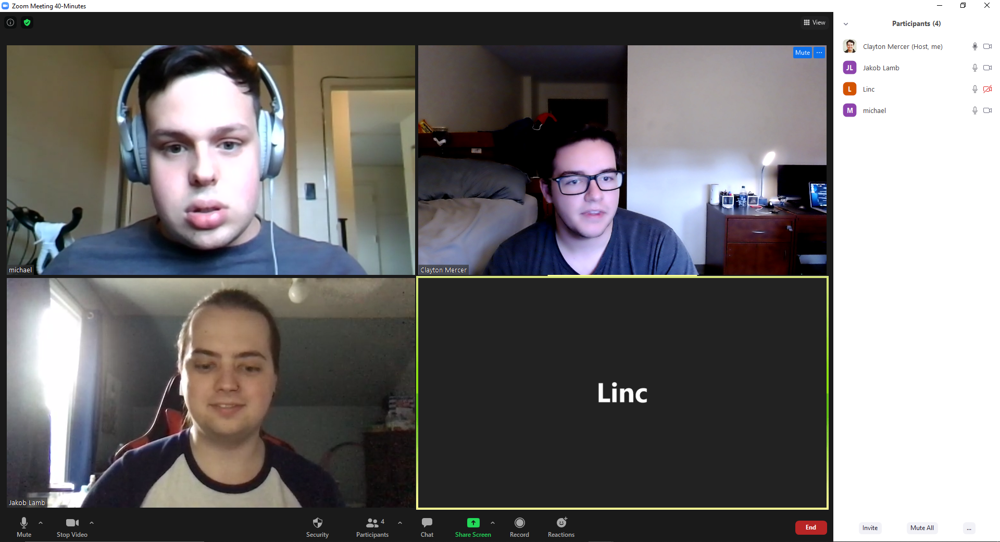

## Members present
Clayton Mercer, Michael Keen, Jakob Lamb, Christopher Staszewski, Linc Mitchell, Iris Lewis-Beasley

## Topics
- Introductions
- Company background
- Project Summary

## Things clarified
#### Iris
- Resources for team and names
- Needs for app and requirements
- Business backgrounds
#### Trey
- Set platform for communcation
- Their own ticketing system
- Jira login and task management
- Gather Atlassian usernames for team (Clayton)
- Everyone use personal emails for Atlassian
- Hand offs: Use Atlassian Bitbucket for repos
- Atlassian Confluence setup
#### Linc
- Acutenc is in trust accounting
- Bought Money Tree
- Use AWS
- System used by: Executive role, Investor role, Trust officer (admin and finacial advisor), and Operations role (Data entry and posting income)
- Project takes web application and moves it to mobile. 
- Xamarin
- Entire stack is .NET based

## Screenshot
- Screenshot came later because we forgot to get the screenshot the first time. This is just a screenshot for the requirement, but every person in the team was present in the real first meeting. 
